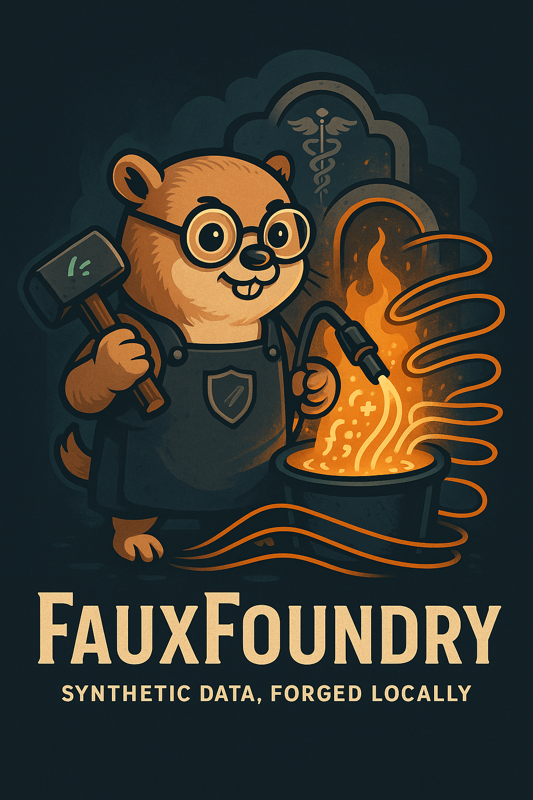

<div align="center">
  
  
  # FauxFoundry
  
  **A powerful CLI and TUI for synthetic, domain-aware data generation powered by local LLMs.**
</div>

FauxFoundry enables teams to generate unique synthetic datasets from human-readable YAML specifications. It leverages local AI models (e.g., Ollama) to produce realistic, domain-aware data that respects schema constraints while ensuring exactly N unique records are delivered through efficient streaming with minimal validation overhead.

**Created by [copyleftdev](https://github.com/copyleftdev)** - Building tools for developers, by developers.

## ✨ Features

- 🎯 **YAML-Driven**: Simple, human-readable specifications
- 🤖 **LLM-Powered**: Uses local models (Ollama) for realistic data generation
- 🔄 **Streaming**: Constant memory usage, handles large datasets efficiently
- 🎨 **Rich TUI**: Interactive terminal interface for guided workflows
- ⚡ **CLI-First**: Automation-friendly command-line interface
- 🔒 **Privacy-First**: All processing happens locally, no data leaves your machine
- 📊 **Real-time Monitoring**: Live progress tracking and statistics
- ✅ **Validation**: Built-in specification validation and error handling
- 🏥 **Healthcare Ready**: EDI, FHIR, HL7, and medical claims support
- 🔄 **Intelligent Retry**: Advanced timeout handling with adaptive strategies
- 🎲 **Deduplication**: Ensures 100% unique records with canonical hashing
- 📈 **Production Scale**: Generate millions of records with constant memory usage

## 🚀 Quick Start

### Prerequisites

- Go 1.21 or later
- [Ollama](https://ollama.ai) running locally with a model (e.g., `llama3.1:8b`)

### Installation

```bash
# Clone the repository
git clone https://github.com/copyleftdev/faux-foundry
cd faux-foundry

# Build the binary
go build -o bin/fauxfoundry ./cmd/fauxfoundry

# Or install directly
go install ./cmd/fauxfoundry

# Check installation
./bin/fauxfoundry --version
```

### Basic Usage

1. **Create a specification**:
```bash
fauxfoundry init customer.yaml --template ecommerce
```

2. **Validate the specification**:
```bash
fauxfoundry validate customer.yaml
```

3. **Generate synthetic data**:
```bash
fauxfoundry generate --spec customer.yaml --output outputs/data.jsonl
```

4. **Launch interactive TUI**:
```bash
fauxfoundry tui
```

## 📋 Specification Format

FauxFoundry uses YAML specifications to define your data generation requirements:

```yaml
model:
  endpoint: "http://localhost:11434"
  name: "llama3.1:8b"
  batch_size: 32
  temperature: 0.7

dataset:
  count: 1000
  domain: "E-commerce customer data"
  fields:
    - name: "email"
      type: "email"
      required: true
      pattern: "@(gmail|yahoo|outlook)\\.com$"
    - name: "age"
      type: "integer"
      required: true
      range: [18, 80]
    - name: "status"
      type: "enum"
      required: true
      values: ["active", "inactive", "pending"]
    - name: "created_at"
      type: "datetime"
      required: true
      description: "Account creation date"
    - name: "preferences"
      type: "object"
      description: "Customer preferences and settings"
```

### Field Types

- `string` - Text strings
- `text` - Longer text content
- `integer` - Whole numbers
- `float` - Decimal numbers
- `boolean` - True/false values
- `datetime` - ISO 8601 timestamps
- `date` - Date values
- `time` - Time values
- `email` - Email addresses
- `url` - URLs
- `uuid` - UUID values
- `phone` - Phone numbers
- `enum` - Predefined values
- `object` - Nested objects
- `array` - Arrays of values

### Field Constraints

- `required` - Field must be present
- `pattern` - Regex pattern for validation
- `range` - Min/max values for numbers
- `values` - Allowed values for enums
- `description` - Field description for LLM context

## 🖥️ CLI Commands

### `generate` - Generate synthetic data

Generate synthetic data from YAML specifications with advanced options:

```bash
# Basic generation
fauxfoundry generate --spec customer.yaml

# Override count and specify output
fauxfoundry generate --spec customer.yaml --count 5000 --output outputs/data.jsonl.gz

# Dry run validation
fauxfoundry generate --spec customer.yaml --dry-run

# Interactive mode
fauxfoundry generate --interactive

# Advanced timeout handling
fauxfoundry generate --spec complex-edi.yaml --max-retries 5 --min-batch-size 1

# Custom timeout and seed
fauxfoundry generate --spec customer.yaml --timeout 30m --seed 12345
```

**Flags:**
- `-s, --spec string` - Path to YAML specification file (required)
- `-o, --output string` - Output file path (stdout if not specified)
- `-n, --count int` - Override record count from specification
- `-t, --timeout string` - Maximum execution time (default "2h")
- `--seed int` - Random seed for reproducibility
- `--dry-run` - Validate specification without generating data
- `-i, --interactive` - Launch interactive TUI mode
- `--max-retries int` - Maximum retry attempts on timeout (default 3)
- `--min-batch-size int` - Minimum batch size before giving up (default 1)

### `validate` - Validate specifications

Validate YAML specifications for syntax and semantic correctness:

```bash
# Validate single file
fauxfoundry validate customer.yaml

# Validate multiple files
fauxfoundry validate *.yaml

# Verbose validation with detailed output
fauxfoundry validate customer.yaml --verbose

# Quiet validation (errors only)
fauxfoundry validate customer.yaml --quiet
```

**Flags:**
- `--dry-run` - Same as validate (included for consistency)
- `-v, --verbose` - Enable detailed validation output
- `-q, --quiet` - Show only errors

### `init` - Create new specifications

Create new YAML specifications from templates or interactively:

```bash
# Interactive creation
fauxfoundry init customer.yaml

# From template
fauxfoundry init --template ecommerce customer.yaml

# Available templates
fauxfoundry init --list-templates

# Force overwrite existing file
fauxfoundry init --force customer.yaml --template medical
```

**Available Templates:**
- `ecommerce` - E-commerce customer data
- `user` - User profiles and authentication
- `product` - Product catalog with pricing
- `medical` - Healthcare and medical records
- `financial` - Financial transactions and accounts

**Flags:**
- `--template string` - Use predefined template
- `--list-templates` - Show available templates
- `--force` - Overwrite existing files

### `tui` - Launch interactive interface

Launch the rich Terminal User Interface for guided workflows:

```bash
# Launch TUI
fauxfoundry tui

# Launch with specific spec
fauxfoundry tui --spec customer.yaml

# Launch in specific mode
fauxfoundry tui --mode generate
```

**Flags:**
- `--spec string` - Load specific specification file
- `--mode string` - Start in specific mode (browse, edit, generate, monitor)

### `doctor` - System health check

Diagnose system health and Ollama connectivity:

```bash
# Full system check
fauxfoundry doctor

# Check specific endpoint
fauxfoundry doctor --endpoint http://localhost:11434

# Verbose diagnostics
fauxfoundry doctor --verbose
```

**Flags:**
- `--endpoint string` - Ollama endpoint to check
- `--fix` - Attempt to fix common issues
- `--models` - List available models

## 🎨 Terminal User Interface (TUI)

The TUI provides a rich, interactive experience with:

- **Specification Editor**: Visual YAML editing with validation
- **Generation Monitor**: Real-time progress and statistics
- **File Browser**: Manage specifications and outputs
- **Settings Panel**: Configure models and preferences

### Keyboard Shortcuts

- `F1` - Help
- `F2` - Specification Browser
- `F3` - Generate Data
- `F4` - Monitor Generation
- `F10` - Quit
- `Ctrl+N` - New Specification
- `Ctrl+S` - Save
- `Tab/Shift+Tab` - Navigate components

## 🔧 Configuration

### Global Flags

- `--config` - Configuration file path
- `--verbose` - Enable verbose logging
- `--quiet` - Suppress non-essential output
- `--no-color` - Disable colored output

### Model Configuration

Configure your LLM backend in the specification:

```yaml
model:
  endpoint: "http://localhost:11434"  # Ollama endpoint
  name: "llama3.1:8b"                # Model name
  batch_size: 32                     # Records per batch
  temperature: 0.7                   # Creativity (0-2)
  timeout: "30s"                     # Request timeout
```

## 📊 Output Format

FauxFoundry generates data in JSON Lines (JSONL) format:

```jsonl
{"email": "john.doe@gmail.com", "age": 34, "status": "active", "created_at": "2023-05-15T10:30:00Z", "preferences": {"newsletter": true}}
{"email": "jane.smith@yahoo.com", "age": 28, "status": "pending", "created_at": "2023-06-20T14:45:00Z", "preferences": {"newsletter": false}}
```

Output can be:
- Streamed to stdout
- Saved to files (`.jsonl` or `.jsonl.gz`)
- Piped to other tools (`jq`, databases, etc.)

## 🏗️ Architecture

```
┌─────────────────────────────────────────────────────────────┐
│                    FauxFoundry Interface                    │
├─────────────────────────────────────────────────────────────┤
│  CLI Layer          │  TUI Layer          │  Shared Core    │
│  ┌─────────────┐    │  ┌─────────────┐    │  ┌─────────────┐ │
│  │ Cobra CLI   │    │  │ Bubble Tea  │    │  │ Spec Parser │ │
│  │ Commands    │    │  │ Components  │    │  │ LLM Client  │ │
│  │ Flags       │    │  │ Views       │    │  │ Dedup Logic │ │
│  │ Validation  │    │  │ Models      │    │  │ Output      │ │
│  └─────────────┘    │  └─────────────┘    │  └─────────────┘ │
└─────────────────────────────────────────────────────────────┘
```

## 📁 Project Structure

```
faux-foundry/
├── cmd/fauxfoundry/     # Main application entry point
├── internal/            # Internal packages
│   ├── cli/            # CLI commands and logic
│   ├── tui/            # Terminal UI components
│   ├── llm/            # LLM client and Ollama integration
│   ├── spec/           # YAML specification parsing
│   ├── dedup/          # Record deduplication logic
│   └── output/         # Output writers (JSONL, compression)
├── pkg/types/          # Shared type definitions
├── examples/           # Sample YAML specifications
├── outputs/            # Generated data files (gitignored)
└── docs/              # Documentation (PRD, design specs)
```

## 🧪 Examples & Use Cases

FauxFoundry includes comprehensive example specifications for various domains:

### 📊 Business & E-commerce
- `customer.yaml` - E-commerce customer data with demographics
- `product.yaml` - Product catalog with pricing and inventory
- `user.yaml` - User profiles and authentication data

### 🏥 Healthcare & Medical
- `medical-demo.yaml` - Basic medical insurance verification
- `medical-insurance.yaml` - Comprehensive 46-field insurance data
- `edi-270-271.yaml` - EDI X12 healthcare eligibility transactions (53 fields)
- `rx-claims-edi.yaml` - NCPDP D.0 pharmacy claims (75+ fields)
- `x12-837-core.yaml` - X12 837 Professional Claims (66 fields)

### 💼 Enterprise & Integration
- `financial-transactions.yaml` - Banking and payment data
- `api-logs.yaml` - Application logs and metrics
- `inventory-management.yaml` - Supply chain and logistics

### 🎯 Real-World Applications

**Healthcare Systems:**
```bash
# Generate 1000 medical insurance records
fauxfoundry generate --spec examples/medical-insurance.yaml --count 1000 --output outputs/insurance-test-data.jsonl

# Create EDI test transactions
fauxfoundry generate --spec examples/edi-270-271.yaml --count 100 --output outputs/edi-test.jsonl.gz
```

**Development & Testing:**
```bash
# Generate customer test data for QA
fauxfoundry generate --spec examples/customer.yaml --count 50000 --output outputs/qa-customers.jsonl

# Create reproducible test datasets
fauxfoundry generate --spec examples/user.yaml --seed 12345 --count 1000
```

**Performance Testing:**
```bash
# Generate large datasets with streaming
fauxfoundry generate --spec examples/product.yaml --count 1000000 --output outputs/products.jsonl.gz

# Stress test with complex specifications
fauxfoundry generate --spec examples/x12-837-core.yaml --count 10000 --max-retries 5
```

## 🤝 Contributing

We welcome contributions from the community! Here's how to get started:

1. **Fork the repository** on GitHub
2. **Create a feature branch** (`git checkout -b feature/amazing-feature`)
3. **Make your changes** with proper tests and documentation
4. **Run tests** (`go test ./...`)
5. **Commit your changes** (`git commit -m 'Add amazing feature'`)
6. **Push to the branch** (`git push origin feature/amazing-feature`)
7. **Open a Pull Request** with a clear description

### Development Setup

```bash
# Clone your fork
git clone https://github.com/yourusername/faux-foundry
cd faux-foundry

# Install dependencies
go mod download

# Run tests
go test ./...

# Build and test locally
go build -o bin/fauxfoundry ./cmd/fauxfoundry
./bin/fauxfoundry doctor
```

### Code Guidelines

- Follow Go best practices and `gofmt` formatting
- Add tests for new functionality
- Update documentation for user-facing changes
- Use conventional commit messages

## 📄 License

This project is licensed under the **MIT License** - see the [LICENSE](LICENSE) file for details.

### Open Source Commitment

FauxFoundry is committed to being a truly open-source project:
- ✅ No vendor lock-in or proprietary dependencies
- ✅ Local-first processing (your data never leaves your machine)
- ✅ Community-driven development and feature requests
- ✅ Transparent development process

## 🙏 Acknowledgments & Credits

**Created by [copyleftdev](https://github.com/copyleftdev)** with ❤️ for the developer community.

### Technology Stack

- **[Ollama](https://ollama.ai)** - Local LLM infrastructure and model management
- **[Cobra](https://github.com/spf13/cobra)** - Powerful CLI framework for Go
- **[Bubble Tea](https://github.com/charmbracelet/bubbletea)** - Terminal UI framework
- **[Lip Gloss](https://github.com/charmbracelet/lipgloss)** - Terminal styling and layout
- **[Go](https://golang.org)** - Systems programming language

### Healthcare Standards

- **ANSI X12** - EDI transaction standards for healthcare
- **NCPDP** - Pharmacy claims processing standards
- **HL7 FHIR** - Healthcare interoperability standards
- **ICD-10** - International disease classification
- **CPT** - Current Procedural Terminology codes

### Community

Special thanks to the open-source community and all contributors who help make FauxFoundry better!

---

## 🚀 Get Started Today

```bash
# Quick start - generate your first synthetic dataset
git clone https://github.com/copyleftdev/faux-foundry
cd faux-foundry
go build -o bin/fauxfoundry ./cmd/fauxfoundry
./bin/fauxfoundry init my-data.yaml --template ecommerce
./bin/fauxfoundry generate --spec my-data.yaml --count 100
```

**FauxFoundry** - Generate synthetic data with confidence 🎯

*Built by developers, for developers. Privacy-first. Open source. Production ready.*
